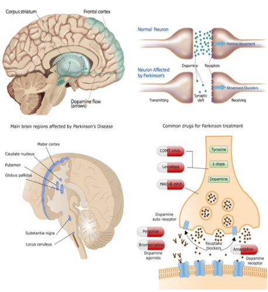
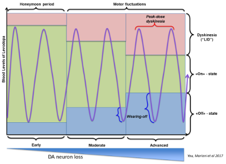
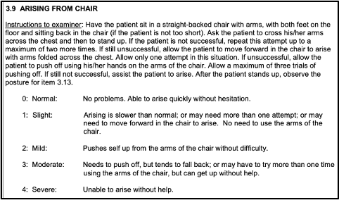
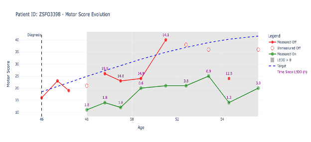

# Challenge context

Parkinson’s disease (PD) is the second most common neurodegenerative disorder after Alzheimer’s. More than 10 million people live with PD worldwide (~200,000 in France, ~25,000 new cases per year). Motor symptoms - rigidity, resting tremor, bradykinesia - come from loss of dopaminergic neurons. Dopamine acts on the basal ganglia network that controls movement.

*Figure 1 - Anatomy of Parkinson’s disease: dopamine pathways, affected regions, synapse comparison, and common drugs. Source: [Summit For Stem Cell](https://www.summitforstemcell.org/glossary-of-parkinsons-disease/).*

Treatment is dopamine replacement therapy (DRT). Response changes as the disease progresses:

- Early (“honeymoon”) phase: motor control is fairly stable through the day.
- Later: **wearing-off**: symptoms return at the end of a dose.
- Advanced: patients fluctuate between a good **ON** state (medication effective) and a bad **OFF** state (levodopa concentration too low).

The OFF state is the motor status without treatment effect. It is used as a surrogate of dopaminergic denervation and therefore of disease severity.

*Figure 2 - Treatment response across stages of PD. The therapeutic window narrows; peaks hit dyskinesia and troughs hit wearing-off.*

Motor severity is scored with the MDS-UPDRS. Motor items are rated 0 (normal) to 4 (severe) on 18 items covering akinesia, rigidity, and tremor across body parts, giving 33 subscores and a total between 0 and 132.

*Figure 3 - Example motor examination item. Source: [International Parkinson and Movement Disorder Society](https://www.movementdisorders.org/MDS/MDS-Rating-Scales/MDS-Unified-Parkinsons-Disease-Rating-Scale-MDS-UPDRS.htm).*

## Challenge goals

Observed motor scores depend on treatment response, age, disease duration, dose, and time since last intake. Scores typically improve 50–100% from OFF to ON.

The OFF score is the scientifically useful proxy of neurodegeneration, but it is biased in practice:

1. Human subjectivity in scoring.
2. Missing or incorrect values.
3. Fluctuating levodopa blood levels at assessment time.
4. OFF exams are uncomfortable, so they are rarely done; often only ON is available.

For this challenge a **true OFF** target was estimated by removing those biases. It is not available in real care. Participants must recover that estimation process and predict the true OFF at every visit.

*Figure 4 - Example trajectory: measured ON/OFF, missing OFF, LEDD period, hours since intake, and the true-OFF target.*

**Key modelling problems**

- **Temporal progression**: capture how motor scores evolve over visits for each patient.
- **Drug timing**: use delay between intake and assessment to unbias the OFF score.
- **Missing data**: visits are irregular; ON, OFF, LEDD, and genetics are often missing.

## Data

The tables are **synthetic**, built to match the structure, relationships, and missingness of multi-cohort PD records. Each patient has several visits at irregular intervals. In the generative model, levodopa effect is proportional to blood concentration: a fast absorption phase, then a decline toward zero. The pharmacodynamic response curve is held constant over age (a simplification; in life it changes with progression).

Each visit has at least one of ON/OFF plus the true-OFF target.

`X_test` patients do **not** overlap train patients: the holdout is by patient.

## Benchmark

A simple heuristic: predict true OFF as the mean OFF score, adjusted by time since disease onset, plus the mean OFF at diagnosis. It is meant as a floor, not a competitive model. Better solutions should use the full feature set, missingness, and intake timing.
