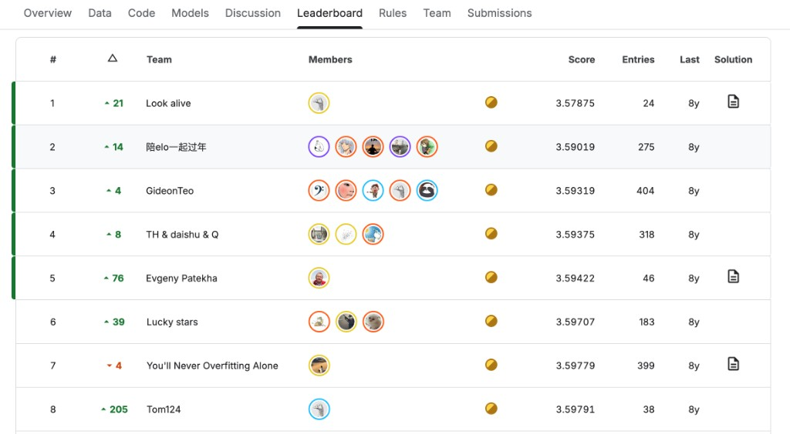

# Lab guidé

Travaillez **dans Bob** (IDE ou CLI) avec les skills du lab. Chaque fichier Kaggle doit être produit là, puis uploadé avec une **URL EstimatorReport** Skore Hub dans la Submission Description. Voir les [règles de la compétition](https://www.kaggle.com/competitions/ibm-probabl-hackaton/rules).

Les snippets matchent les librairies **installées** : `skore` 0.25.0, `scikit-learn` 1.9.0, `skrub` 0.10.0. N'inventez pas d'autres noms de symboles. Mettez une **nouvelle** clé de report Hub pour chaque fichier Kaggle (`01_dummy`, `02_ridge`, …). N'utilisez **pas** la clé réservée `eda` pour un modèle.

Rejoignez Kaggle et formez votre team **avant** d'installer Python sur votre machine.

## 1. Rejoindre Kaggle et former une team

**Kaggle** est un site de compétitions data-science : vous téléchargez les data, vous uploadez un fichier de prédictions, et vous obtenez un score public sur un **leaderboard**. La compétition privée de ce lab vit là. Il vous faut un compte Kaggle gratuit.



*Exemple de leaderboard — teams classées par score (plus bas est mieux ici). Le vôtre ressemblera à ça après les premières Submissions.*

Ouvrez la compétition et acceptez les règles : [https://www.kaggle.com/t/1d3caaf98f12426cb621b47f2063ab28](https://www.kaggle.com/t/1d3caaf98f12426cb621b47f2063ab28).

Puis formez **une team Kaggle** (maximum quatre personnes). Retenez le **nom exact de la team**. Vous le réutiliserez comme nom de workspace Skore Hub à l'étape 3.

## 2. Python

Il vous faut un interpréteur **Python 3.10+** qui marche sur votre `PATH`. Vérifiez :

```bash
python --version
```

Si ça échoue, essayez `python3 --version`. Utilisez la même commande (`python` ou `python3`) pour le reste du lab. Installez Python depuis [python.org](https://www.python.org/downloads/) si aucun des deux ne marche.

## 3. Compte Hub et workspace d'équipe

Créez (ou connectez-vous à) un compte Skore Hub sur le **hub custom du lab** : [https://ibm.skore.probabl.ai](https://ibm.skore.probabl.ai).

**Un Hub workspace par team Kaggle — pas un par personne.**

1. **Un** teammate crée le workspace.
2. Le **nom du workspace doit matcher le nom de la team Kaggle** (pas de `/` dans le nom ; si Hub refuse les espaces ou la ponctuation, utilisez les mêmes mots avec des tirets).
3. Cette personne **invite les autres teammates** dans ce workspace.
4. Tous les autres **rejoignent l'invite**. Ne créez pas un second workspace.

`python scripts/install_skore.py` (étape suivante) attend que vous soyez membre d'**exactement un** Hub workspace. Des workspaces perso en trop cassent cet install.

Vous utiliserez **Bob IDE ou Bob CLI** plus **skore** pour chaque Submission — pas Cursor, Claude Code, Copilot, ChatGPT, ni Kaggle Notebooks.

## 4. Installer skore

Depuis la racine du repo, une fois que vous êtes dans le Hub workspace de la team :

```bash
python scripts/install_skore.py
```

Confirmez que `.skore` et `.bob/skills/` existent.

## 5. Data dans `data/`

Les tables de la compétition ne sont **pas** dans git (`data/*.csv` est ignoré). Téléchargez les fichiers depuis l'[onglet **Data** de la compétition](https://www.kaggle.com/competitions/ibm-probabl-hackaton/data) et dézippez-les dans un dossier `data/` à la racine du repo.

Vous devriez voir `X_train.csv`, `y_train.csv`, `X_test.csv`, et `sample_submission.csv`. Chaque teammate a encore besoin de ces CSV en local (le share Hub ne remplace pas le download).

## 6. Explorer les data (EDA)

**Exploratory data analysis (EDA)** : regarder les tables *avant* de choisir un modèle : shape, missingness, groupes `patient_id`, ce qui ressemble à un leak. Dans Bob, c'est l'étape **G-EDA** (`explore-ml-data`). Elle écrit `data/eda.py`, un court narratif `data/eda.md`, et des pages interactives `data/eda_<table>.html`.

**Un seul teammate calcule l'EDA.** Cette personne choisit **run** dans Bob. Quand c'est fini, Bob uploade ces fichiers dans le Hub workspace de la team sous la clé réservée `eda`.

Tous les autres **ne doivent pas lancer une seconde EDA**. Quand Bob lookup Hub :

- si la clé `eda` est déjà là, il **fetch** les fichiers sur leur machine ;
- si un teammate est encore en train de la calculer, choisissez **wait** — ne commencez pas le modelling, ne skippez pas. Quand cette personne a uploadé, dites-le et Bob fetch.

Même dataset, mêmes findings. Un run suffit ; Hub est la copie partagée.

## 7. Dummy mean : un floor

Si vous n'arrivez pas à battre la prédiction de la moyenne du training set, rien d'autre ne marche (data load, métrique, upload). Commencez par charger les visites.

Chaque **row** est une **visite**. La target est un score moteur MDS-UPDRS **true / unbiased OFF** (`y_train.target`). Les scores cliniques ON/OFF sont biaisés (subjectivité, valeurs manquantes, timing lévodopa).

- `patient_id` : plusieurs visites par patient. Le holdout Kaggle est **par patient**.
- **Missingness** : `on`, `off`, `ledd`, `gene`, délais de prise sont souvent manquants.
- **ON / OFF / LEDD / timing** : `on`, `off`, `ledd`, `time_since_intake_on`, `time_since_intake_off`. Sur le train, les années depuis le diagnostic valent `age - age_at_diagnosis` (le test peut déjà avoir `time_since_diagnosis`).

```python
import pandas as pd

X_train = pd.read_csv("data/X_train.csv")
y_train = pd.read_csv("data/y_train.csv")
X_test = pd.read_csv("data/X_test.csv")

visits = X_train.merge(y_train, on="Index")
y = visits["target"]
```

Utilisez `sample_submission.csv` comme template de shape : colonnes `Index,target`.

- **C'est quoi** : Dummy prédit toujours le même nombre : la moyenne du true OFF en train.
- **Comment ça marche** : il ignore toutes les colonnes. Vous passez quand même un `X` pour que `skore.evaluate` aligne les mêmes rows que `y`.
- **Pourquoi ici** : si vous ne battez pas ce floor, c'est le data load, la métrique, ou l'upload qui est cassé — pas le modèle.

```python
from sklearn.dummy import DummyRegressor
from skore import evaluate

feature_cols = [
    "sexM",
    "age_at_diagnosis",
    "age",
    "ledd",
    "time_since_intake_on",
    "time_since_intake_off",
    "on",
    "off",
]
X = visits[feature_cols]
y = visits["target"]

dummy = DummyRegressor(strategy="mean")
report = evaluate(dummy, X, y)
report.metrics.rmse()
```

`skore.evaluate` est le point d'entrée. Sans `splitter=`, il utilise le défaut `splitter=0.2` (un holdout aléatoire sur les rows). Ça suffit pour checker le floor ; les splits groupés arrivent à l'étape 10.

**Project** stocke les reports. **Hub** est requis pour une Submission valide (l'URL affichée après `put`). `name=` est votre projet dans le hub workspace lu depuis `.skore`. Toujours `load_skore_credentials()` puis `login(mode="hub")` :

```python
from parkinson.hub import load_skore_credentials
from skore import Project, login

cfg = load_skore_credentials()
login(mode="hub")
project = Project(name="ibm-hackaton", mode="hub", workspace=cfg["workspace"])
project.put("01_dummy", report)
# La console affiche : Consult your report at https://ibm.skore.probabl.ai/…
```

`Project.get` se fait par **id** depuis `project.summarize()`, pas par la string key passée à `put`.

## 8. Un modèle linéaire simple

Les variables cliniques numériques (`age`, `on`, `off`, `ledd`, délais) peuvent porter un signal additif simple.

- **C'est quoi** : Ridge trace une droite : true OFF prédit ≈ intercept + (un poids × chaque colonne).
- **Comment ça marche** : il choisit les poids pour que les prédictions matchent `y`, puis `alpha` tire ces poids vers zéro pour qu'une colonne bruitée ne domine pas.
- **Pourquoi ici** : un premier check que les nombres comptent vraiment. Ridge ne mange que des nombres sans trous, donc median-impute d'abord et laissez les strings comme `gene` pour plus tard.

```python
from sklearn.impute import SimpleImputer
from sklearn.linear_model import Ridge
from sklearn.pipeline import make_pipeline
from skore import evaluate

ridge = make_pipeline(
    SimpleImputer(strategy="median"),
    Ridge(alpha=1.0),
)
report = evaluate(ridge, X, y)
```

`make_pipeline(*steps)` enchaîne les transformers puis le regressor. Comparez dummy vs ridge dans un seul report :

```python
report = evaluate(
    {"dummy": dummy, "ridge": ridge},
    X,
    y,
)
```

`put` avec une nouvelle key. Le holdout row par défaut peut encore leak le même patient des deux côtés — le CV groupé est l'étape 10.

## 9. Tweaker Ridge et submit sur Kaggle

`Ridge(alpha=…)` est le knob : un `alpha` plus grand shrink plus les coefficients. Changez-le, relancez `evaluate`, gardez celui qui bat dummy le plus.

```python
ridge = make_pipeline(
    SimpleImputer(strategy="median"),
    Ridge(alpha=10.0),  # essayer 0.1, 1.0, 10.0, …
)
report = evaluate(ridge, X, y)
report.metrics.rmse()
project.put("02_ridge", report)
```

`evaluate` score seulement sur le train. Le fichier que vous uploadez, c'est ce pipeline **fit sur toutes les visites de train**, puis `predict` sur `X_test` (mêmes colonnes que `X`) :

```python
from sklearn.base import clone

final = clone(ridge).fit(X, y)
submission = X_test[["Index"]].copy()
submission["target"] = final.predict(X_test[feature_cols])
submission.to_csv("submission.csv", index=False)
```

Uploadez `submission.csv` sur Kaggle. Une Submission n'est valide que si :

1. Le code a été écrit et run dans **Bob**, l'évaluation via **skore**.
2. Vous `put` ce report Ridge ; la console montre `https://ibm.skore.probabl.ai/…`.
3. Le header CSV est `Index,target`, une row par visite test.
4. La **Submission Description** Kaggle contient cette URL de report (sinon la row est invalide même si Kaggle a scoré le fichier).

Les modèles suivants utilisent le même chemin fit → CSV → URL.

## 10. Évaluer avec un CV groupé par patient

Le défaut `splitter=0.2` shuffle les **rows**. C'est trop gentil ici.

- **C'est quoi** : GroupKFold est une répétition générale du split Kaggle : un patient entier va en train ou dans le fold held-out, jamais les deux.
- **Comment ça marche** : il coupe les patients en 5 groupes. Cinq fois, il train sur 4 groupes et score sur le 5ᵉ, puis vous lisez le RMSE moyen.
- **Pourquoi ici** : la même personne a beaucoup de visites. Un split row aléatoire est du **leakage** : des visites d'un même patient sont des deux côtés, donc le modèle mémorise cette personne au lieu de généraliser, et la métrique a l'air meilleure que la compétition Kaggle (qui holdout des patients entiers). Le CV groupé bloque ce leak.

Le path sklearn de skore appelle `splitter.split(X, y)` **sans** `groups=`, donc précalculez les paires d'index :

```python
from sklearn.model_selection import GroupKFold
from skore import evaluate

groups = visits["patient_id"]
cv_splits = list(GroupKFold(n_splits=5).split(X, y, groups=groups))
report = evaluate(
    {"dummy": dummy, "ridge": ridge},
    X,
    y,
    splitter=cv_splits,
)
report.metrics.summarize()          # table de métriques
report.metrics.get("rmse")          # ou report.metrics.rmse()
```

- `splitter=` une liste de paires d'index (ou `5`, ou un CV splitter) → `CrossValidationReport`
- plusieurs estimators (list ou dict) → `ComparisonReport`

Utilisez `cv_splits` à partir d'ici. `put` ce report avec une nouvelle key.

skrub DataOps peut attacher `groups` sur le graphe — voir l'étape 13.

## 11. HistGradientBoosting : la missingness comme signal

ON/OFF/LEDD/génétique sont souvent manquants ; la missingness fait partie du process génératif (voir [CONTEXT.md](CONTEXT.md)). Ridge devait *remplir* ces trous avec une médiane. Ici on garde les trous.

- **C'est quoi** : un **decision tree** est un flowchart de questions oui/non (`age > 62 ?`, `on` manquant ?). Chaque visite descend le flowchart jusqu'à une leaf, et cette leaf prédit un nombre (un true OFF typique pour les visites qui sont tombées là). **Boosting** : on ne s'arrête pas à un arbre : on en fait pousser beaucoup de petits, en séquence, et chaque nouvel arbre est trainé sur les *erreurs* des précédents. La prédiction finale est la somme de toutes ces petites corrections. **Hist** (histogram) est un trick d'implémentation : chaque colonne numérique est d'abord découpée en quelques buckets (comme un histogramme), donc le modèle regarde des ids de buckets au lieu de chaque âge distinct. Ça reste rapide sur des dizaines de milliers de visites.
- **Comment ça marche** —
  - L'arbre 1 fit un rough sketch du true OFF.
  - L'arbre 2 regarde les residuals (true OFF moins ce que l'arbre 1 a prédit) et essaie d'expliquer ce qui est encore faux.
  - Les arbres 3, 4, … continuent de grignoter l'erreur restante. C'est du gradient boosting, en clair : continuer d'ajouter un petit expert sur les erreurs restantes.
  - À un split, l'algo peut envoyer les valeurs **manquantes** à gauche ou à droite exprès. Il apprend cette route depuis le training data — donc « OFF n'a pas été mesuré » peut être un signal, pas un défaut.
  - `random_state=0` rend seulement le run reproductible.
- **Pourquoi ici** : dans cette table, un OFF manquant veut souvent dire que la visite était ON-only (les examens OFF inconfortables sont skippés). C'est de l'information sur le patient et le protocole, pas du bruit à imputer. Ne **remplissez pas** les NaNs à la médiane sauf si vous testez cette ablation (est-ce que le modèle devient *pire* quand vous cachez les trous ?).

```python
from sklearn.ensemble import HistGradientBoostingRegressor
from skore import evaluate

hgbr = HistGradientBoostingRegressor(random_state=0)
report = evaluate(hgbr, X, y, splitter=cv_splits)
```

Les strings restent un problème : par défaut le modèle veut des nombres ou des dtypes pandas `category`. `categorical_features="from_dtype"` (le défaut) traite une colonne `category` comme « choisir parmi quelques labels » au lieu d'un faux nombre. Convertissez `cohort` / `gene` avec `.astype("category")` si vous les ajoutez à `X`.

## 12. skrub `tabular_pipeline` : types mixtes sans encoding à la main

Ridge et le HGBR numérique ci-dessus n'ont jamais vu `gene` ni `cohort` : ce sont des **strings**. Un regressor sklearn ne peut pas multiplier `"GBA"` par un poids. Il faut d'abord transformer le texte en nombres. Le faire à la main (un encoder custom par colonne) est là où les pipelines pourrissent d'habitude.

- **C'est quoi** : `tabular_pipeline("regressor")` est une recette ready-made en deux étapes de skrub : (1) `TableVectorizer` transforme une table messy en matrice numérique, (2) `HistGradientBoostingRegressor` prédit. Vous droppez les ids, vous passez le reste, et le vectorizer choisit un encoder **par colonne**.
- **Comment ça marche** : « cardinality » = combien de valeurs distinctes a une colonne.
  - **Low cardinality** (une poignée de labels, ex. `sexM`, peut-être `cohort`) → **one-hot** : une nouvelle colonne par label, `1` si cette row l'a, `0` sinon. Le modèle voit un switch, pas un ranking inventé des labels.
  - **High cardinality** (beaucoup de strings distinctes, ex. `gene` si c'est messy) → `StringEncoder` : compresser le texte en quelques dimensions numériques au lieu de des centaines de colonnes one-hot. Vous gardez le signal sans exploser la largeur de `X`.
  - **Nombres** (`age`, `on`, `ledd`, …) passent. HGBR peut toujours utiliser leurs NaNs, comme à l'étape 11.
  - `Index` et `patient_id` sont des identifiants, pas des features cliniques. Si vous les laissez, le modèle peut mémoriser les ids — une autre forme de leakage. Droppez-les (et `target`) avant le fit.
- **Pourquoi ici** : les colonnes PD intéressantes sont mixtes : des nombres avec des trous *et* des catégorielles. Cette étape, c'est comment arrêter de jeter `gene` / `cohort` juste parce que Ridge ne savait pas les lire.

```python
from skrub import tabular_pipeline
from skore import evaluate

# inclure les catégorielles ; garder Index / patient_id hors des features
X_full = visits.drop(columns=["Index", "patient_id", "target"])
model = tabular_pipeline("regressor")
report = evaluate(model, X_full, y, splitter=cv_splits)
```

Même vectorizer, votre propre estimator (si vous voulez tweaker HGBR) :

```python
from sklearn.pipeline import make_pipeline
from skrub import TableVectorizer
from sklearn.ensemble import HistGradientBoostingRegressor

model = make_pipeline(
    TableVectorizer(),
    HistGradientBoostingRegressor(random_state=0),
)
```


## 13. skrub DataOps : groups baked dans le graphe

Jusqu'ici vous jongliez avec des objets séparés : un DataFrame `visits`, une liste `cv_splits`, un pipeline `model`. Facile de fitter sur les mauvaises colonnes ou d'oublier `groups` après un copy-paste. **DataOps** est la façon skrub d'écrire la *recette* une fois, comme un graphe, pour que features, target, et split groupé vivent sur le même objet.

- **C'est quoi** : un DataOp n'est pas encore la prédiction. C'est un plan delayed : « quand tu me donnes une table nommée `visits`, drop `target`, vectorize, puis applique HGBR. » `skore.evaluate` marche ce plan et run le CV que vous y avez attaché.
- **Comment ça marche** —
  - `skrub.var("visits", visits)` nomme un **input**. Plus tard, au predict time, vous pouvez passer une autre table sous le même nom (`X_test`).
  - `.skb.mark_as_X(...)` dit à skore « ce nœud est la table de features. » `.skb.mark_as_y()` mark la target. Ces deux marks, c'est comment `evaluate` sait quoi splitter.
  - Passer `cv=GroupKFold(...)` et `split_kwargs={"groups": groups}` **sur** `mark_as_X` bake le CV groupé par patient dans le graphe. Vous n'avez plus à garder une liste à côté `cv_splits` qui peut devenir stale.
  - `.skb.apply(transformer)` / `.skb.apply(estimator, y=...)` append une step, comme `make_pipeline`, mais sur le graphe.
  - `evaluate(pred)` **sans** `splitter=` lit `cv` / `groups` depuis le DataOp. C'est le point : le split ne peut pas dériver loin des data.
  - `skrub.X(value)` est un raccourci pour `skrub.var("X", value).skb.mark_as_X()` : pas de `cv` extra sauf si vous rappelez `mark_as_X`.
  - `.skb.make_learner()` **freeze** le graphe en `SkrubLearner`. Ensuite `fit` / `predict` prennent un **environment dict** (`{"visits": ...}`), parce que l'input était un `var` nommé, pas un array nu. Vous en avez besoin pour le fichier Kaggle : le test n'a pas de `target`.
- **Pourquoi ici** : GroupKFold ne marche que si `groups` est le `patient_id` des *mêmes* rows que `X`. Le mettre sur le graphe, c'est comment empêcher le leakage de l'étape 10 de revenir par un argument oublié.

```python
import skrub
from sklearn.ensemble import HistGradientBoostingRegressor
from sklearn.model_selection import GroupKFold
from skore import evaluate

data = skrub.var("visits", visits)
groups = data["patient_id"]
X_op = data.drop("target", axis=1).skb.mark_as_X(
    cv=GroupKFold(n_splits=5),
    split_kwargs={"groups": groups},
)
y_op = data["target"].skb.mark_as_y()
pred = X_op.skb.apply(skrub.TableVectorizer()).skb.apply(
    HistGradientBoostingRegressor(random_state=0),
    y=y_op,
)

# evaluate lit cv / groups depuis le DataOp quand splitter est omis
report = evaluate(pred)
```


## 14. Fitter le modèle choisi et submit à nouveau

Le CV groupé (étapes 10–13) vous dit quelle idée est meilleure. Submittez-la comme Ridge (étape 9) : `put` un **nouveau** report hub, fit sur **toutes** les visites de train, `predict` sur `X_test`, uploadez le CSV avec cette URL dans la Description.

```python
from sklearn.base import clone

final = clone(model).fit(X_full, y)
submission = X_test[["Index"]].copy()
submission["target"] = final.predict(X_test.drop(columns=["Index", "patient_id"], errors="ignore"))
submission.to_csv("submission.csv", index=False)
```

Alignez les colonnes test avec ce sur quoi vous avez trainé (mêmes drops, mêmes dtypes). Pour un DataOp / `SkrubLearner` :

```python
learner = pred.skb.make_learner()
learner.fit({"visits": visits})
pred_test = learner.predict({"visits": X_test})
```

Ensuite : [CONTEXT.md](CONTEXT.md) pour timing / missingness / progression, la page Description Kaggle pour les fichiers et la métrique.
